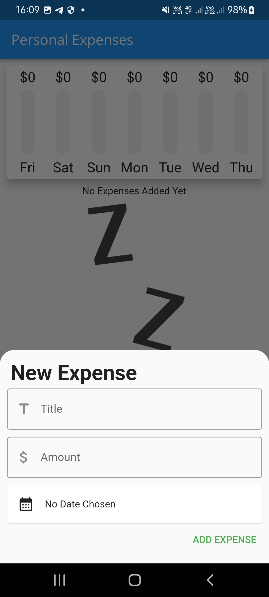
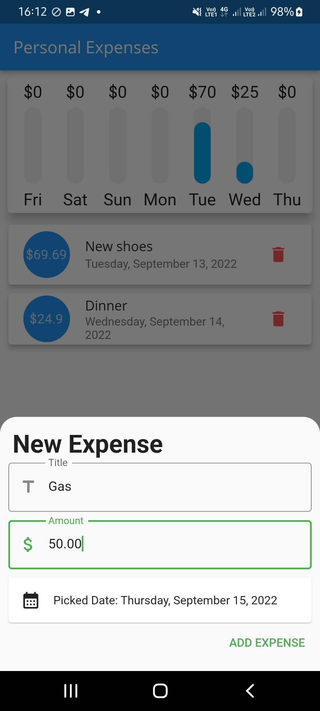
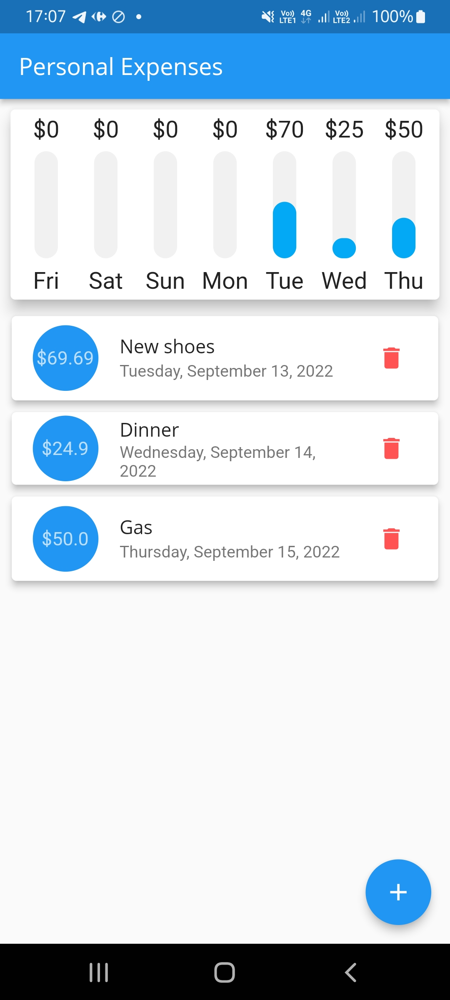
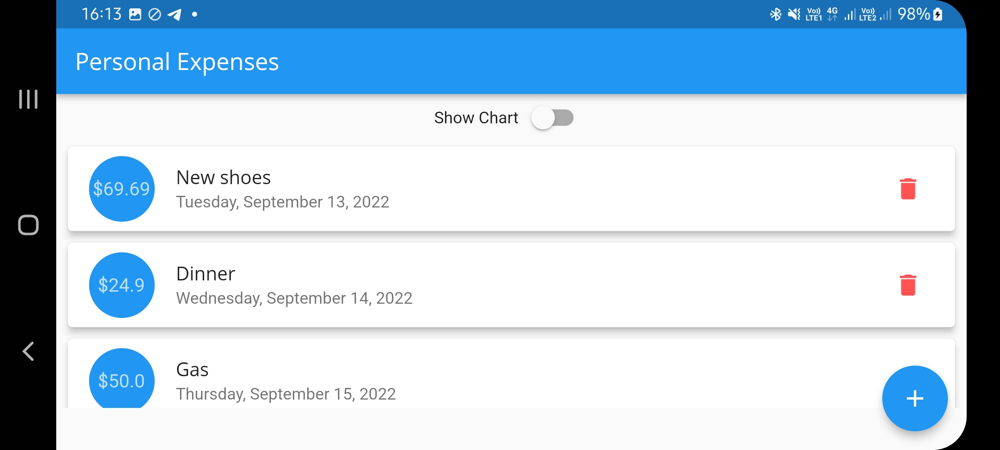
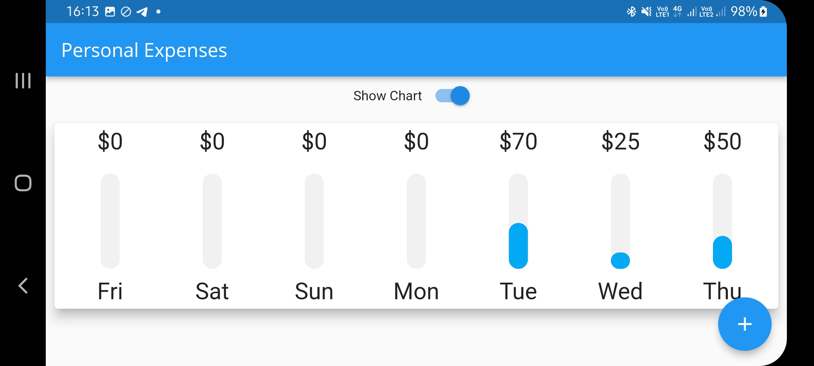

# Personal Expenses

Hello there.
This is a simples expenses saver app developed in flutter.
This app was developed according to the classes of:

Flutter & Dart - The Complete Guide [2022 Edition] - UDEMY;

Flutter Tutorial - SQL Database Storage Using Sqlite & Sqflite CRUD | Android & iOS - Johannes Milke Youtube Chanel;

### Versions

- **Flutter**: 3.0.5
- **Dart**: 2.17.6

### Setup

Clone it in your machine:
```bash
git clone https://github.com/RodrigoNP3/Personal-Expenses.git
```

Dependecies

```bash
dependencies:
  cupertino_icons: ^1.0.2
  intl: ^0.17.0
  sqflite: ^2.0.3
```

### Navigation

<table>
<thead>
<tr>
<th align="center">Home screen</th>
<th align="center">Add Expense</th>
<th align="center">screen </th>
  <th align="center">screen </th>

</tr>
</thead>
<tbody>
<tr>
  
<td align="center">
  <a target="_blank" rel="" href="images/Screenshot_20220915-160832.jpg">
        

  </a></td>
  
<td align="center">
  <a target="_blank" rel="" href="images/Screenshot_20220915-160947.jpg">
        

  </a></td>
  
  
<td align="center">
  <a target="_blank" rel="" href="images/Screenshot_20220915-161217.jpg">
        

  </a></td>
  
  
<td align="center">
  <a target="_blank" rel="" href="images/Screenshot_20220915-170746.jpg">
        

  </a></td>
  
 
  
  
</tr>
</tbody>
</table>

<table>
<thead>
<tr>
<th align="center">Home screen landscape</th>
<th align="center">Home screen landscape</th>


</tr>
</thead>
<tbody>
<tr>
  
<td align="center">
  <a target="_blank" rel="" href="images/Screenshot_20220915-161338.jpg">
        

  </a></td>
  
<td align="center">
  <a target="_blank" rel="" href="images/Screenshot_20220915-161331.jpg">
        

  </a></td>
  
  
 
  
  
</tr>
</tbody>
</table>
